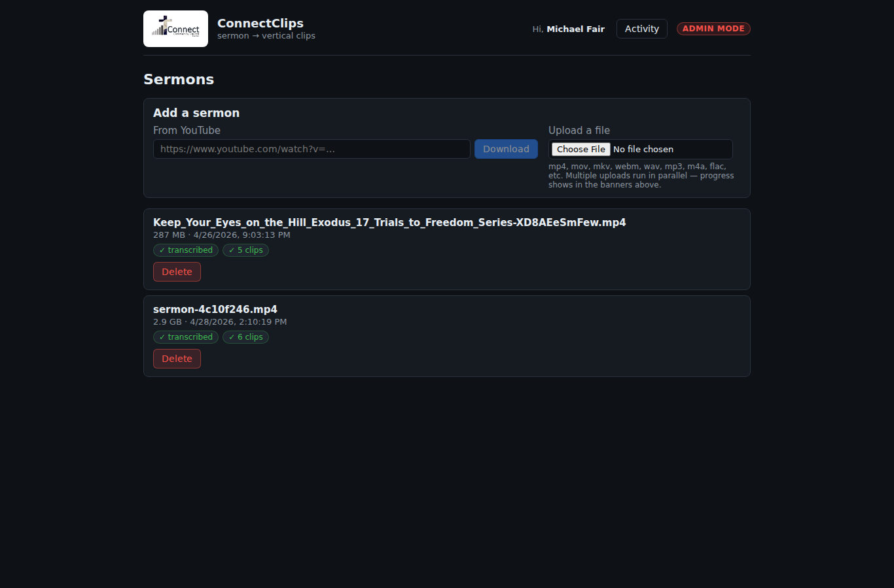
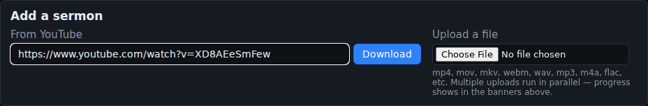
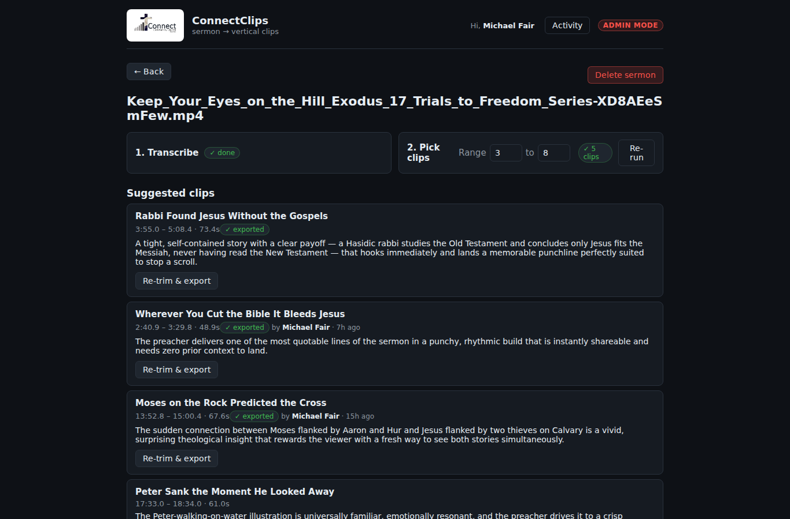
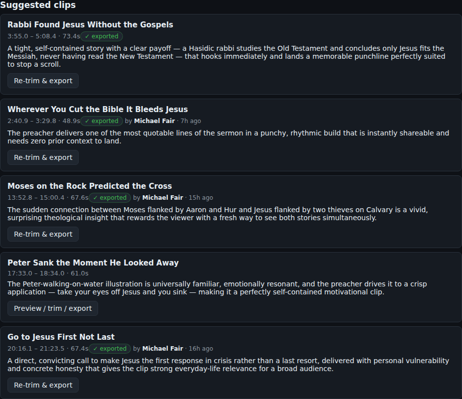
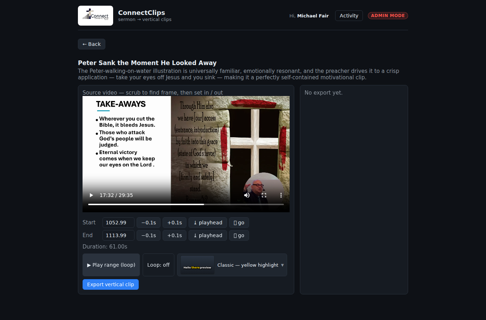
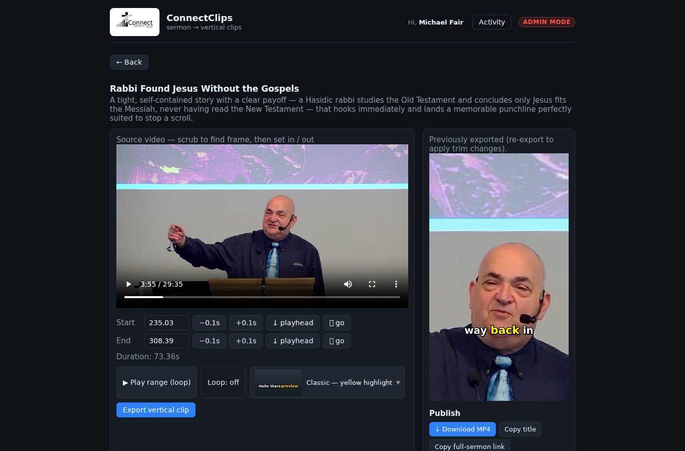
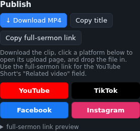
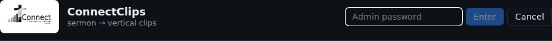

# ConnectClips Operator's Manual

A step-by-step guide for the volunteer who turns Sunday's sermon into a week of short-form videos for YouTube Shorts, Facebook Reels, Instagram Reels, and TikTok.

## What this tool does

You drop a sermon recording in. ConnectClips:

1. Transcribes the audio.
2. Asks Claude to pick the most clip-worthy moments and rate each one's hook strength.
3. Scans the whole sermon once for faces so trimming and exporting stay fast later on.
4. Reframes each pick from horizontal (16:9) to vertical (9:16) with face tracking.
5. Burns in word-by-word karaoke-style captions.
6. Hands you a 1080×1920 MP4 ready to upload to short-form platforms.

You then trim, export, download, and schedule each clip on each platform.

---

## Before your first session

You need three things:

- **The URL** to access ConnectClips. Either `http://localhost:8765/` if you're sitting at the streaming PC, or the Tailscale URL if you're working from a laptop on the church's tailnet.
- **The admin password**, only if you'll be deleting old sermons. (Volunteers don't need it for the day-to-day workflow.)
- **A YouTube account login** for Connect Community Church's channel, plus FB/IG/TikTok if you'll be cross-posting.

---

## The weekly rhythm

```
Sunday morning   – Service livestream.
Sunday afternoon – Mike  edits and uploads the sermon-only video to YouTube
                   (separate from the full livestream).
Sun pm / Mon am  – YOU do everything below. ~1.5 hours total.
Mon–Fri          – Scheduled posts go live automatically. Nothing for you to do.
```

You start as soon as the Mike has uploaded the sermon-only — typically Sunday afternoon or evening. Whether you do the work Sunday night or Monday morning is up to you, **but the first clip needs to be scheduled before noon Monday so it can post that day**.

If life gets in the way and you don't get to it until Monday afternoon, that's fine — shift the schedule to **Tuesday through Saturday** instead. Both cadences work; just pick one and be consistent week to week.

The whole flow ends with five clips queued across three places (YouTube Studio, Meta Business Suite, TikTok), set to drop one per day for five days running.

---

## The full workflow, start to finish

### Step 1 — Open ConnectClips

Open the URL in any browser (Chrome, Edge, Safari).



You'll see a list of sermons. Each one has two status badges:

- **Transcribed** — green ✓ once the words have been extracted.
- **N clips** — green ✓ once Claude has picked clip candidates.

If both are green, you can skip ahead to Step 4.

### Step 2 — Add this week's sermon

In the **Add a sermon** panel at the top:

**Option A — From YouTube** (recommended)

Paste the URL of this week's **sermon-only** YouTube upload (not the full livestream).



Click **Download**. The button shows "Downloading…" while it pulls the video. When it finishes, the new sermon appears in the list below.

**Option B — File upload**

If the sermon is a local file, click **Choose File**, pick the video or audio, and wait for "Uploading…" to finish.

### Step 3 — Run the pipeline

Click the new sermon's row to open its detail page.



Two numbered steps:

**1. Transcribe** — Click **Run transcribe**. This takes 5–15 minutes for a typical sermon. The button reads "Running…" while it works. Walk away; you don't need to babysit it.

Once transcribe finishes, two things happen automatically in parallel and you don't have to click anything for either:

- **Clip selection** — Claude reads the transcript and picks 7–10 candidate clips with hook scores. Usually finishes in 30–60 seconds.
- **Face scan** — every face in the sermon is located and tracked once, so the trim view loads instantly later. Takes 5–15 minutes on a 50-minute sermon, runs in the background, and is the reason the pipeline shows two activity rows after a transcribe.

**2. Pick clips** — once transcribe is done, the **Range** controls become available. The default "3 to 8" means Claude will return between 3 and 8 candidate clips.


For a typical sermon, **leave it at 3 to 8** the first time. If you want more options to choose from, change it to **5 to 10** before clicking. If you only want the very best moments, try **2 to 3**.

Click **Run clip selection**. This usually takes 30–60 seconds. When it's done, the page shows a list of suggested clips below.

### Step 4 — Review & trim each clip

Each suggested clip is a card showing:

- The clip's title (Claude wrote it; you can change it later when you upload)
- The time range and duration
- A **hook score** out of 100 — Claude's prediction of how well the first 3 seconds will stop a cold scroller's thumb. Use this to sequence your week — see Step 7.
- A short rationale — *why Claude thinks this moment will perform well*



Click **Preview / trim / export** on the first clip. You'll land in the trim view.



The vertical preview on the right starts up almost immediately because the face scan ran during ingest. (If you opened the trim view *before* the face scan finished, you'll briefly see "Scanning faces…" while it catches up — usually a few seconds, occasionally a few minutes if the scan is still running.)

**The left side** shows the full sermon video. Scrub it like any normal video player.

**The trim controls** (under the video):

| Control | What it does |
|---|---|
| **Start / End** number boxes | Type a precise time, or use the buttons to nudge |
| **−0.1s / +0.1s** | Shift start or end by a tenth of a second |
| **⤓ playhead** | Set start (or end) to wherever the video is currently parked |
| **⏭ go** | Jump the video to the current start (or end). Use this to *check* what frame you've set. |
| **▶ Play range (loop)** | Plays just the trimmed range and loops, so you can hear how the clip will feel |
| **Loop: on / off** | Toggle the loop on or off |
| **Export vertical clip** | Kick off the reframing + caption pipeline |

**Typical trim sequence:**

1. Click **▶ Play range (loop)** to hear the clip Claude picked.
2. Listen to the very start. If it cuts in awkwardly, click pause where you want to start, then **⤓ playhead** on the Start row.
3. Listen to the very end. If the last word is clipped, **⏭ go** on the End row to see the last frame, then **+0.1s** until it sounds clean.
4. Re-loop with **▶ Play range** to confirm.

**If the sermon has more than one speaker on camera** (a guest, a panel, an interview), a small **face strip** appears under the preview with one thumbnail per face the scanner found, plus an **Auto** pill. Click a thumbnail to lock the reframing onto that person; click **Auto** to let it pick the most prominent face per moment (the default and almost always right for a solo sermon, where the strip won't appear at all).

When happy, click **Export vertical clip**. It runs for ~30–60 seconds. Don't navigate away.

### Step 5 — Verify the export

The exported clip appears in the right column and starts auto-playing on loop.



Watch it once start to finish. Check three things:

- **Pastor stays in frame.** Some moments may show the slide artwork — that's fine if it's a slide-only moment in the source. If the entire clip is slide art with no pastor, you probably need to re-trim past that section.
- **Captions appear** with the current word highlighted in yellow.
- **The end isn't cut off mid-word.** If it is, re-trim with end +0.3s or so and re-export.

If the clip is bad, just re-trim and click **Export vertical clip** again. It'll overwrite the previous version.

### Step 6 — Publish (download + cross-post)

Below the preview is the **Publish** panel.



Three action buttons across the top:

- **↓ Download MP4** — saves the clip to your Downloads folder. You'll drag this file into each platform's upload page.
- **Copy title** — puts Claude's title on your clipboard. Paste into the platform's caption field.
- **Copy full-sermon link** — only shows when the source came from YouTube. This is the URL of the original sermon at the exact timestamp the clip was taken from. **Critical for YouTube Shorts** — paste it into the "Related Video" field so viewers can click through to the full sermon.

Below those are four colored platform buttons:

| Button | Opens | What you do |
|---|---|---|
| **YouTube** (red) | YouTube Studio | Upload the MP4. Set Visibility to **Schedule**. Paste the full-sermon link in the **Related Video** field. |
| **TikTok** (black) | TikTok upload page | Drop the MP4. Toggle **Schedule** and set the time. |
| **Facebook** (blue) | Facebook Reels Composer | Drop the MP4. From a Page, you can also use Meta Business Suite for cleaner scheduling. |
| **Instagram** (pink) | Instagram Reels upload | Drop the MP4. (IG strongly prefers mobile — see "Posting from your phone" below.) |

### Step 7 — Schedule, don't post

Don't click "Post Now" on any platform. Always **Schedule** instead. Recommended cadence: **5 clips per week, one per day at noon, for five consecutive days** — Mon-Fri if you finished the work on Sunday night, or Tue-Sat if you got to it on Monday afternoon.

Sequence by hook strength, regardless of which day you start:

| Day of the run | Use the clip that... |
|---|---|
| Day 1 | has the highest hook score |
| Day 2 | has the second-highest hook score |
| Day 3 | is a teaching/insight moment |
| Day 4 | is a story/testimony moment |
| Day 5 | is encouraging or applicable |

The hook score on each clip card is your fastest sort. For Days 3–5, read each clip's **rationale** to figure out which is which.

The strongest hook goes first because Day 1 gets the most algorithmic momentum on YouTube Shorts and TikTok — they boost newly active channels harder when the first post performs well.

### Step 8 — Repeat for the remaining clips

Go back (← Back button), pick the next clip, repeat Steps 4–7. Each clip takes about 5–10 minutes once you have the rhythm.

---

## Posting from your phone

For **Instagram Reels** specifically, the web upload is unreliable. The flow that actually works:

1. Email yourself the downloaded MP4 (or save to OneDrive / Google Drive).
2. Open it on your phone.
3. Open Instagram → New Post → Reel.
4. Select the MP4 from your phone's gallery.
5. Paste the title from a note you've prepped on your phone.
6. Schedule.

Same trick works for TikTok if the web flow gives you trouble.

---

## Admin mode (deleting old sermons)

This is for the Mike, not day-to-day volunteers. To free up disk space when an old sermon is no longer needed:

1. Click **Enter admin mode** in the top-right of the header.



2. Type the admin password and press Enter. The button swaps to a red **ADMIN MODE** badge with an Exit button.


3. Each sermon row now has a red **Delete** button. Clicking it asks you to confirm, then removes:
   - The source video file
   - The transcript
   - The clips.json (Claude's picks)
   - Every exported MP4 from that sermon

This is **permanent**. Don't delete a sermon you might want to re-clip later.

4. Click **Exit** when you're done. Always exit admin mode before walking away from the computer.

---

## Troubleshooting

**The page doesn't load at all.**
The backend isn't running. On the streaming PC, open WSL and run:
```bash
~/ConnectClips/scripts/start-server.sh
```
Then refresh.

**"Admin password not configured" when I try to enter admin mode.**
Mike hasn't set `ADMIN_PASSWORD` in `backend/.env` on the streaming PC. Ask him to do that and restart the backend.

**Transcribe is stuck on "Running…" for hours.**
Whisper occasionally hangs on weird audio. Refresh the page; if the badge still says "not transcribed," ask the Mike to check the WSL terminal for errors.

**Clip selection returned the same 5 clips after I changed the range.**
Check that your range *excludes* whatever count Claude is consistently picking. If 5 is in the range, Claude may legitimately keep choosing 5 because that's how many strong moments exist in the sermon. Try `2 to 3` (force fewer) or `8 to 10` (force more).

**The exported clip shows the slide artwork instead of the pastor.**
The pastor's PiP at that moment was too small for the face tracker to see. Three options:
1. Re-trim to start past the slide-heavy section (most common fix).
2. Accept it — slide artwork can look interesting and isn't a deal-breaker.
3. Pick a different clip from the suggestions list.

**The reframing followed the wrong person** (e.g. a guest instead of the pastor).
If the face strip appeared under the preview, click the correct face thumbnail and re-export. If no strip appeared, the scanner only found one face throughout the sermon — which usually means the "wrong" face is actually the only face on camera in that moment.

**The trim view sits on "Scanning faces…" for a long time.**
The face scan for this sermon hadn't finished yet when you clicked in. It runs in the background after transcribe; for a fresh upload it takes 5–15 minutes. Either wait a bit, or come back to this clip after working on a different sermon.

**The last word is cut off.**
Re-trim with end pushed +0.3s and re-export. (As of recent updates, new clip selections automatically add a small breath-pad to avoid this.)

**Captions are out of sync.**
Hard-refresh the browser (Ctrl+Shift+R). The browser may be playing a cached older version of the file.

---

## Quick reference card

| What you want to do | Where in the app |
|---|---|
| Add a sermon from YouTube | Sermon list → top panel → paste URL → Download |
| Upload a local file | Sermon list → top panel → Choose File |
| See what's already in progress | Sermon list — status badges on each row |
| Run transcribe | Sermon detail → Step 1 → Run transcribe |
| Pick clips (or re-pick) | Sermon detail → Step 2 → set range → Run / Re-run |
| Trim and export a clip | Click "Preview / trim / export" on a clip card |
| Pick which face to follow | Trim view → face strip under the preview (only shows when >1 face) |
| Download a finished clip | Trim view → Publish panel → ↓ Download MP4 |
| Get the YouTube deep-link | Trim view → Publish panel → Copy full-sermon link |
| Open a platform's upload page | Trim view → Publish panel → colored platform button |
| Delete an old sermon | Header → Enter admin mode → Delete on the row |

---

## A note on what this tool can't do

ConnectClips picks moments and reframes them, but it doesn't (yet):

- Generate thumbnails (use the platform's auto-pick, or design one in Canva)
- Write platform-specific captions (Claude's title is a starting point; you'll polish it per platform)
- Detect what makes a clip "viral" (Claude is good at this but not infallible — your editorial judgment in the trim view is the safety net)
- Cross-post in one click (you'll schedule on each platform individually — see Step 7)

The trim view is your editorial gate. If a clip Claude picked feels off, skip it. Quality over quantity always wins on short-form.
